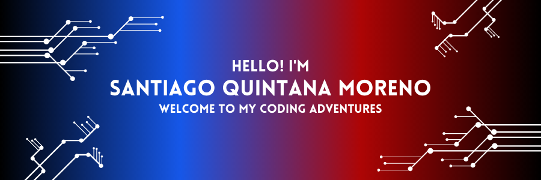

# Hello and Welcome to my coding adventures! 🎉

👋 Hello there! I'm Santiago Quintana, a passionate 20-year-old computer science student from 🇲🇽 Tecnologico de Monterrey. I'm thrilled to share my journey in the world of code and CompSci with you. 🚀

## About Me 🙋‍♂️

📚 I'm currently pursuing my Bachelor's degree in Computer Science, where I dive deep into algorithms, data structures, and software development. The endless possibilities in the tech realm have always fascinated me. I'm especially fascinated with cybersecurity and game development. 

🤖 I had the incredible opportunity to become a programming and electrical mentor at OVERTURE 7421 a team for FIRST FRC (For Inspiration and Recognition of Science and Technology) for the past year and a half. Working with aspiring young minds, fostering their enthusiasm for robotics, and empowering them to think creatively has been a truly rewarding experience. 🤝

## What I Bring to the Table 💼

💡 Curiosity, enthusiasm and a constant search for bettering myself are the driving forces behind my work. I'm constantly seeking new challenges to expand my skill set and knowledge. With every project, I aim to deliver innovative solutions and elegant code.

🌟 I possess a strong foundation in programming languages such as Python, and C++. Additionally, I have hands-on experience with web development using HTML, CSS.

🔧I thrive in collaborative environments, though I can shine as well in solo work. Working as a team or alone, brainstorming ideas is essential for me and my fellow developers. I value teamwork, open communication, and the opportunity to learn from others.

## Projects I'm Proud Of 🏆
Work in progress...
<!-- 
Here are some of the projects I've worked on:

1. 🤖 **RoboHelper** - An autonomous robot designed to assist the elderly with everyday tasks. Built using Python, OpenCV, and ROS (Robot Operating System). [Check it out!](https://github.com/your-username/robo-helper)

2. 🎮 **GameGenius** - A game recommendation engine based on user preferences and machine learning. Developed using Python and scikit-learn. [Try it here!](https://github.com/your-username/game-genius)

3. 💬 **ChatMeister** - A real-time chat application with end-to-end encryption. Implemented using React, Node.js, and Socket.io. [Join the conversation!](https://github.com/your-username/chat-meister)

Feel free to explore these projects and provide any feedback or suggestions. I'm always looking for ways to improve!
-->

## Let's Connect! 🌐

🌎 You can find me on various social media platforms. Let's connect and share our love for all things tech:

🐦 [Twitter](https://twitter.com/10qmSanty) - Follow me for exciting tech updates and occasional puns! 🐤

💼 [LinkedIn](https://www.linkedin.com/in/santiago-quintana-moreno-861115192) - Let's connect professionally and discuss opportunities in the tech industry.

📷 [Instagram](https://www.instagram.com/santiagoquintana/) - Let's connect through pictures and stories!

<!--🌐 [Personal Website](https://your-website-url.com) - Explore more about my projects, blog posts, and adventures in the world of code!-->

## Let's Collaborate! 👯‍♀️

I'm always looking for new opportunities to collaborate on exciting projects. If you have any ideas or would like to chat about potential collaborations, feel free to reach out to me at [santy.10qm.gm@gmail.com](mailto:santy.10qm.gm@gmail.com).

Thank you for visiting my GitHub portfolio. I hope you enjoyed exploring my work. Together, let's shape the future through code! 🚀✨

<!--
**SantiQ0905/SantiQ0905** is a ✨ _special_ ✨ repository because its `README.md` (this file) appears on your GitHub profile.

Here are some ideas to get you started:

- 🔭 I’m currently working on ...
- 🌱 I’m currently learning ...
- 👯 I’m looking to collaborate on ...
- 🤔 I’m looking for help with ...
- 💬 Ask me about ...
- 📫 How to reach me: ...
- 😄 Pronouns: ...
- ⚡ Fun fact: ...
-->
